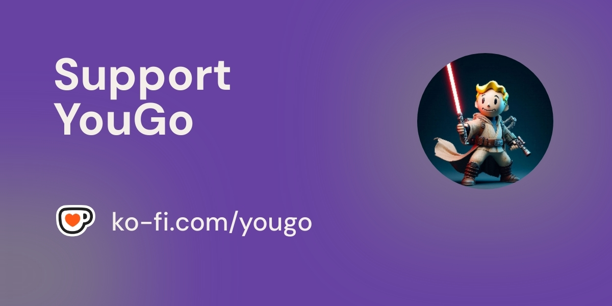

> I build tools to make my life easier, but they regularly do the opposite.  

🇫🇷 French guy.

I enjoy learning languages and other things you don't care about.

- 🇫🇷 French — native
- 🇬🇧 English — B2
- 🇪🇸 Spanish — A2–B1

I make tools related to language learning, among other things.

### Projects

Private or open-source tools, utilities and experiments.

[YouTube No Translation](https://github.com/YouG-o/YouTube-No-Translation) is one of them and my most used tool so far, with ~150k active users across all platforms.

### Support

### Contact

#

