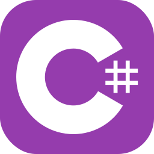

 
  **I've already worked with:**
  
  Languages :
   
  
  
  
  
  
  Front-end :
   
  
  
  
  

  Back-end :
   
  
  
  

  Database :
   
  

  Tools and others :
   
  
  
  
  
  
  
  
  

